# DevOpsWorkshop
A DevOps workshop showing the basics of Jenkins and CI/CD pipelines. 

In this workshop we will be creating a CI/CD pipeline using Jenkins in a Docker container running on Play With Docker. This pipeline will first use Node Package Manager to build a node application and then run the Jslint tool to check for javascript syntax errors. In the next stage a Docker image containing the node application will be built and pushed to a public docker registry on Docker Hub. Lastly, a container with the node application will be deployed to Play With Docker using the latest image from Docker Hub that was pushed in the previous step.

## Prerequisites

Before we get started there are a few prerequisites that are required for this workshop to go smoothly.

- Ensure that you are able to access Play With Docker
- Have an account on Docker Hub
- A github account
- Git cli

1. Fork this repo
    1. In this repo, click on **fork** button at the top right of the page. This will create your own copy of the repo that you can modify.

    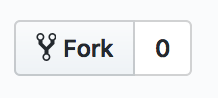

2. Clone the repo locally
    1. Once you are in your own forked repo. Look for the green button that says **"Clone or download"** and copy the repo url that appears. Open

    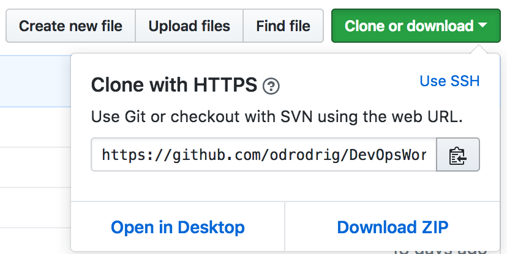

   In this lab there are two methods of editing the code: locally or on the browser.

   **Option 1**: Locally

    2. On your local machine, open Terminal (Command Prompt for Windows users) and enter the following but replace **"{url from earlier}"** with your own repo url that was just copied:

    ```bash
    git clone {url from earlier}
    ```

    This local repo is what we will be modifying and pushing later.

    **Option 2**: Through the browser

    2. For this method we will be editing the code directly in GitHub so cloning locally is not required.

     For now, let's put this aside and move on to creating our CI/CD pipeline.

3. For this workshop, we will be using Play with Docker for our Docker environment. Play with Docker allows you to well... play with Docker in a browser without having to download any additional software. If you haven't already, visit [Docker Hub](https://hub.docker.com/) and create an account.
    1. Go to https://labs.play-with-docker.com/

    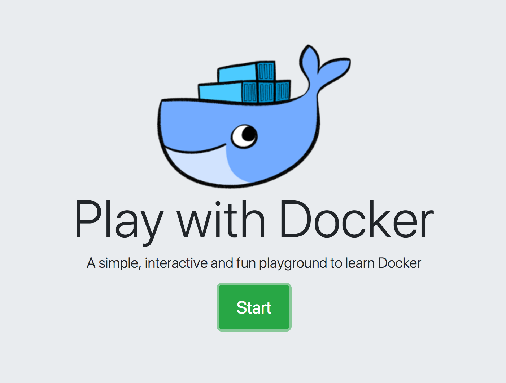

    2. Sign in with your Docker Hub account. After signing in, you will be taken to the docker environment. These sessions only last for four hours at a time and then are deleted. Fortunately, this lab won't take that long.

4. Now we can create a Jenkins container to host our CI/CD pipeline.
    1. Click on the **Add new instance** link to create a new instance of the sandbox environment which is a container configured with Docker.

    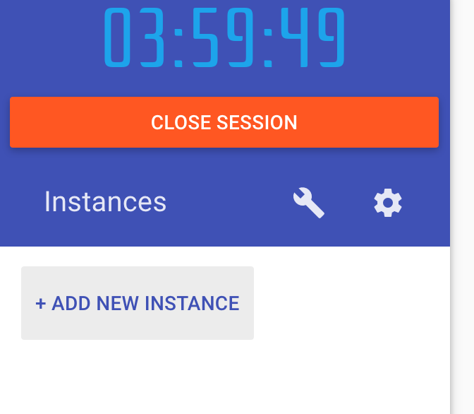

    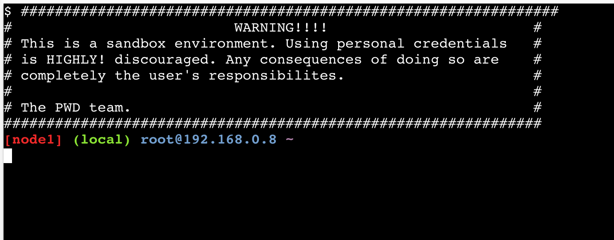

    2. Next, paste the following command in the newly created container:

    ```bash
    docker run -d \
        -p 8079:8080 \
        -p 50000:50000 \
        -v /var/run/docker.sock:/var/run/docker.sock \
        -v jenkins_home:/var/jenkins_home \
        --name jenkins \
        odrodrig/jenkins-docker:latest
    ```

   This command creates a Jenkins container that is configured to run Docker. Let's break down the command piece by piece:

   - **docker run -d** - This is the command used to create new containers. **-d** means that the app runs in detached mode which lets the container run in the background and returns control of the terminal rather than tailing output of the new container. 

   - **-p 8079:8080** - This flag binds a local port to a port in the container. In this case, we are binding the container's port 8080 to the local port, 8079. Same thing with the next line except we are binding port 50000 to port 50000.

   - **-v /var/run/docker.sock:/var/run/docker.sock** - This flag creates a volume inside the new container and copies the docker.sock file from the local file system to the new container's file system. This docker.sock file will allow us to deploy Docker containers within Play with Docker from the Jenkins container. 

   - **--name jenkins** - This just sets the container's name to **jenkins** which allows us to reference the container by name if needed.

   - **odrodrig/jenkins-docker:latest** - This is the image that we will be using to create the new container. 

   When the image is done building you should see the following output:

   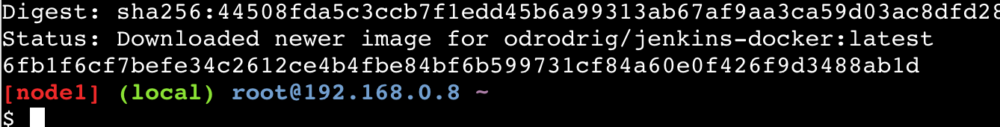

   You can verify that the container is deployed by running the following command:

   ```bash
   docker ps
   ```
   
   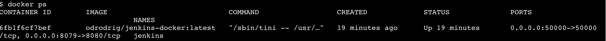

5. Now that Jenkins is running, we need to do some initial configuration.
    1. First, we need to grab the initial admin password. This is output in the logs during the container creation. To access the logs for the container, run the following command:

    ```bash
    docker logs jenkins
    ```

    This command outputs the most recent log output for the container. Look for the following section in the logs:

    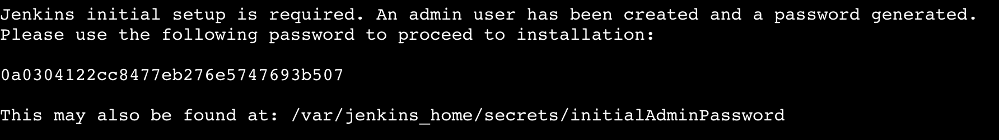

    2. Copy the password from the log output.

    3. Then, near the top of the page you should see two ovals with port numbers in them. These are the port numbers that we are exposing in our Jenkins container. We will be able to access the Jenkins instance by going to port **8079**. Click on the oval for port **8079**.

    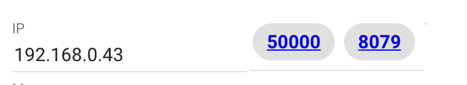

    4. You should now be at the **Getting Started** page for your Jenkins instance. Paste the password you copied earlier into the field labeled **Administrator password**.

    5. Next, click on the button to install suggested plugins. This will give us what we need for our basic pipeline. The installation will take a minute or two so now is a good time for a break.

    !Install plugins](./images/installPlugins.png) 

    6. After the installation of plugins, you will have the opportunity to create a new admin user. This is optional for this workshop but ideally in a production Jenkins environment, you would create new Admin identities instead of using the initial admin credentials. 

        - Optional: To create a new admin user enter a username, password, full name, and email

        - If not creating a new admin user, click the button that says **Continue as Admin**

    7. Lastly, click **Save and Finish** at the bottom of the next page to accept the default Jenkins URL. This will be the external URL to access the Jenkins instance. And with that you are ready to start using Jenkins!

    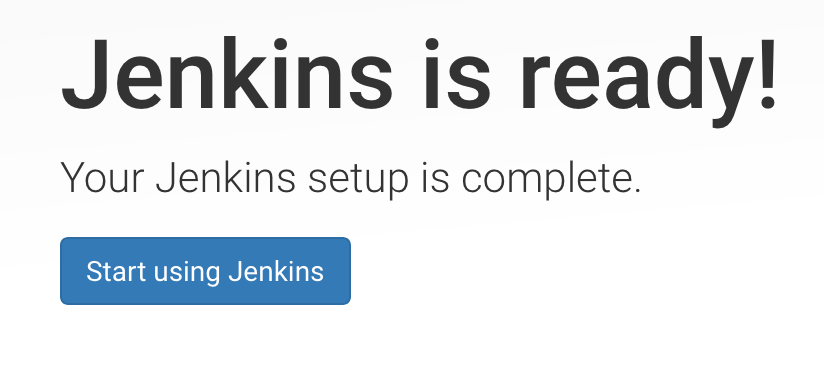

6. Now we are ready to start using Jenkins and build our pipeline
    1. Click on the **Start Using Jenkins** button
    2. Click on either the **create new jobs** hypertext in the center of the page or click on the **New Item** button on the left vertical navigation bar. 

    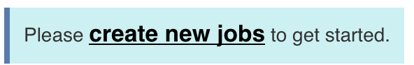 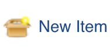

    1. Give your pipeline a name. For this workshop, I'll name mine **"node app"**
    2. Then, select **pipeline** for the job type and then click **ok**
    3. What we need to do now is point our pipeline to the GitHub repo that we forked earlier. In the job configuration, scroll down to the **pipeline** section.

    4. Click on the **Definition** drop down and select **Pipeline script from SCM**

    5. For **SCM**, select **Git** and when the new **Repositories** field appears, enter the repo URL that you copied at the beginning of the workshop.

    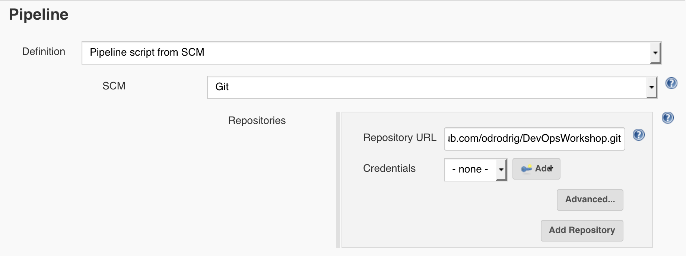

    6. When done, click on **Apply** at the bottom of the page.

    3. The way the pipeline script (Jenkinsfile) in the repo works is that it looks in the Jenkins environment for certain variables which are used for pushing the image to Docker Hub and giving the app a name. The variables that we need to set are:

        - APP_NAME = This will be used to label the resulting Docker image
        - DOCKER_HUB_ACCOUNT - The username of you Docker Hub account. This will be used in conjunction with the APP_NAME to label the image. When labeling the Docker image the format being used is "DOCKER_HUB_ACCOUNT/APP_NAME:BUILD_NUMBER"
        - REGISTRY_CREDENTIALS - This variable won't hold the actual credential values but it will hold the label for the credential set that is stored in Jenkins. More on that later.

    4. Still in the pipeline configuration page, scroll up and select the checkbox labeled **This project is parameterized**

    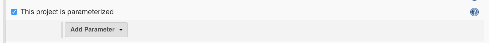

    5. In the dropdown that appears, select **String parameter**. Some new text fields should pop up. Enter the following in the corresponding fields:
    
        - For **Name** enter **APP_NAME**
        - For **Default Value** enter whatever you would like to name your app. In this example, I named the app **node-app**

        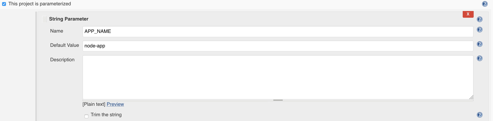

    6. There are two more paramters we need.
        1. Click on the **Add parameter** dropdown and select **String Parameter**
            1. For **Name**, enter **DOCKER_HUB_ACCOUNT**
            2. For **Default Value**, enter your Docker Hub username. 
        2. Click on the **Add parameter** dropdown and select **String Parameter**
            1. For **Name**, enter **REGISTRY_CREDENTIALS**
            2. For **Default Value**, enter **registry_credentials** 
        3. Click **Save** at the bottom of the page

7. Remember earlier how I mentioned that we would store our Docker credentails in Jenkins which would allow us to reference them with the credential ID "registry_credentials"? Now is when we can save those credentials. If this doesn't make sense, it will in the following steps.
    1. Click on the big **Jenkins** at the top left of the page to go back to the home page.
    2. Then, click on the **Credentials** link on the left nav bar.

    

    3. Next, click on **System** which should appear right under **Credentials** on the left nav bar.

    4. On the **System** page, click on **Global credentials** in the center of the page

    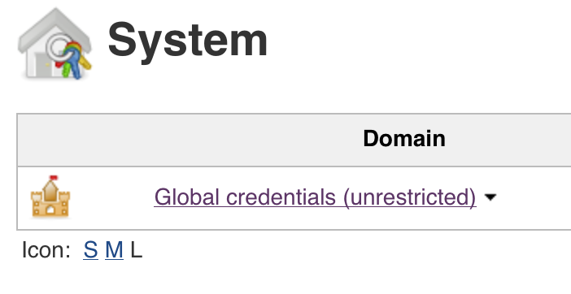

    5. Click on the **Add Credentials** button on the left nav bar 
    6. For the new credentials, leave **Kind** and **Scope** with the default values and enter the following information in their corresponding fields:

        - **Username** - Enter your Docker Hub username
        - **Password** - The password for your Docker Hub account
        - **ID** - **This one is important!** Enter **registry_credentials** in this field.
        - **Description** - Optional: Enter a description so you remember what these credentials are for.

    7. When done, click **OK**

        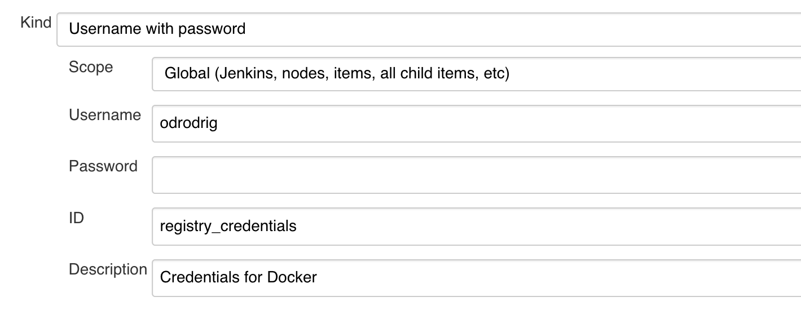

        <dl>
            <dt>Quick note on credential binding</dt>
            <dd>In this pipeline we are using a plugin for "credential binding". This means that we are binding the credentials we supply to environment variables that will be available during the build process. In this case, we are binding our Docker Hub login information to an ID named <b>registry_credentials</b>. We reference this ID in the build paramaters from earlier. </dd>
        </dl>

8. Now we should have everything we need to run the pipeline. Click on **Jenkins at the top right of the page to go back to the home page.

    1. Your pipeline should appear in the center of the page. Click on it.
    2. In the pipeline you should have the option to **Build with Parameters**

    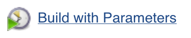

    3. On the next page, you should see the parameters that we defined in the pipeline configuration earlier. The default values should be good since we set them earlier, but if you need a refresher on what each variable is, check out the pipeline configuration steps we went through previously. 

    4. Click **Build**

    1[Start Build](./images/startBuild.png)

    5. After starting the build you should be taken back to the pipeline's main page and a table should now appear showing the build and the status of each stage. On the left of the page, look for the **Build History** table on the left side of the page and click on the little circle that is flashing next to your current build number. This will take you to the console output of the build so you can see the progress.

    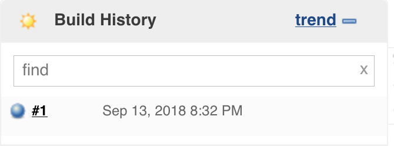

    6. You can follow along with the output as each stage is being built. If you'd like to see the code that is being run, checkout the [Jenkinsfile](Jenkinsfile) in this repo. When you see **Finished: SUCCESS**, that means that the docker image was built, pushed to Docker Hub, and deployed to Play With Docker.

    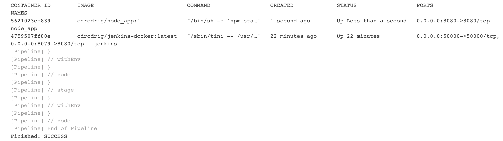

9. Now that the pipeline is finished running and the app deployed, let's verify that the node app container is running on Play With Docker.
    1. Go back to your Play With Docker browser tab
    2. Run the following command:

    ```bash
    docker ps
    ```

   You should now see two containers running in your Play With Docker environment: Jenkins and your new node app container.

   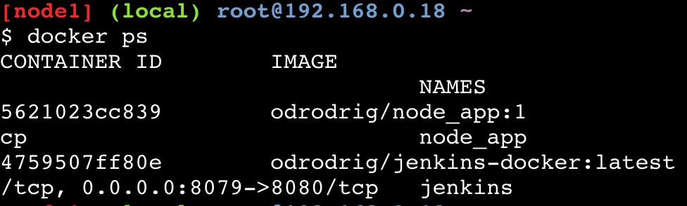

   3. You will also notice that a new port is available at the top of the page. The port, **8080**, is exposed by the node app container and will allow us to visit the app. Click on the port **8080**.

   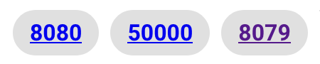

   This is a very simple app that just asks for your name and echos a simple hello message back to you. It doesn't store any data and is the simplest example app I could find. 

   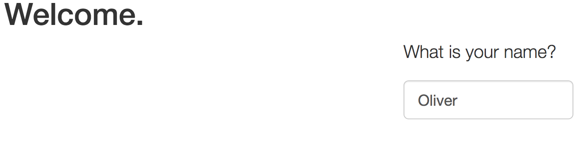

   We have successfully deployed a Node.js app and verified that it is running, but we are not done yet. If you noticed, we had to manually start the build process from Jenkins. In the next section we will focus on automating the build pipeline to begin when code is commited to GitHub. 

10. Let's setup our GitHub Webhooks for automated deployments
    1. Click on **Jenkins** in the top left of the page to go back to the home page.
    2. Click on **Manage Jenkins** on the left nav bar
    3. Then click on **Configure System**
    4. Next, scroll down until you see the section labeled **Github** and click on **Advanced**

    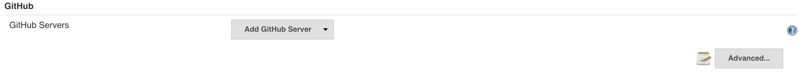

    5. Then click on the question mark icon to the right of **Override Hook URL**. 
    6. Copy the webhook URL that appears in the text box

    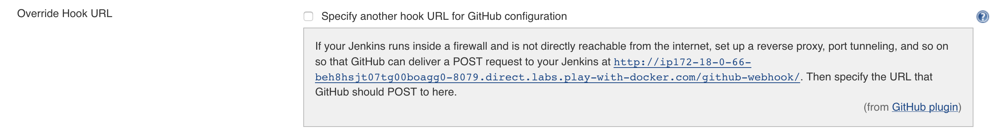

    7. After that, go to the Github repo that you forked earlier. It should be the copy in your github account. 
    8. Click on the **Settings** tab in the repo

    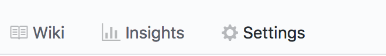

    9. On the left nav bar, click on **Webhooks** and click on **Add webhook**

    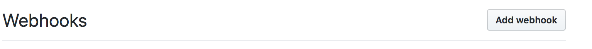

    10. Under **Payload URL**, paste the webhook URL we copied from Jenkins. 
    11. Leave the rest of the fields with the default values and click on the **add webhook** button at the bottom

11. Make change, push, and watch pipeline kick off
12. Visit the app again to see changes